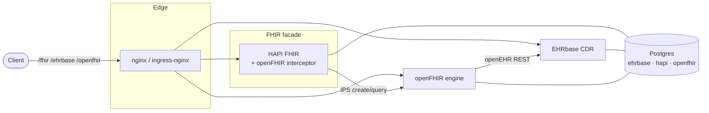

# freshehr-open-health-stack

A dockerized **openEHR → FHIR** health-data stack — HAPI FHIR (with the openFHIR interceptor), EHRbase, the openFHIR
engine, and nginx — shipped as **three independently-runnable infrastructure-as-code layers**:

| Layer          | Path                                           | What it stands up                                                                                                    |
|----------------|------------------------------------------------|----------------------------------------------------------------------------------------------------------------------|
| 1 · Local dev  | [`docker/`](docker/)                           | `docker compose` — all services + 1 Postgres + nginx on your laptop                                                  |
| 2 · Kubernetes | [`charts/health-stack/`](charts/health-stack/) | A **Helm chart** (4 workloads + ingress) with values files for `hetzner` (prod) and `dev` (kind)                     |
| 3 · Cloud      | [`terraform/envs/hetzner/`](terraform/)        | Terraform provisions a **Hetzner k3s** cluster, installs ingress-nginx/cert-manager/CSI, then deploys the Helm chart |

> **Distributable.** The app is one Helm chart, published as an OCI artifact to GHCR,
> so it installs without cloning the repo. The chart never branches on the cloud
> provider — the only provider-specific value is `storage.className` — so adding a
> cloud means one new values file plus a Terraform root for that cloud's cluster.
> Only Hetzner ships today (see [Milestones](#milestones)).

It reproduces the end-state of the Dublin openFHIR hackathon, but with **HAPI FHIR instead of Firely**: the [
`openfhir-hapi-interceptor`](https://github.com/openFHIR/openfhir-hapi-interceptor)
JAR turns HAPI into a FHIR facade that routes IPS (International Patient Summary)
create/query traffic through the openFHIR engine into an EHRbase openEHR CDR, while all other FHIR traffic falls through
to HAPI's own JPA store.

## Architecture



**Routing table** (nginx in compose; ingress-nginx via the Helm chart in k8s):
`/fhir`→HAPI, `/ehrbase`→EHRbase, `/openfhir`→openFHIR engine.

**DB topology:** **one** Postgres instance with a database each for `ehrbase`,
`hapi` and `openfhir` — see [Database topology](#database-topology) for why, and what production should do differently.

## Database topology

All three services share **one Postgres instance**, each with its own database (`ehrbase`, `hapi`, `openfhir`) and owner
role. The databases are created by
[`docker/ehrbase/init-db.sql`](docker/ehrbase/init-db.sql), which runs after the image's own EHRbase bootstrap.

The instance stays on the **`ehrbase/ehrbase-v2-postgres`** image: EHRbase needs the extensions and role layout that
image pre-provisions, while HAPI and openFHIR are schema-agnostic and just need an empty database to build into (HAPI
creates its JPA tables, openFHIR runs its own Flyway migrations).

> **This is a deliberate non-production choice.** One instance is simpler and cheaper
> to run, and for a reference/integration stack the isolation isn't worth the extra
> moving parts. **For production you would almost certainly separate them**, because:
>
> - **Clinical data deserves its own blast radius.** EHRbase is the system of record.
>   A runaway query, a bad migration, or disk exhaustion caused by the mapping engine
>   should not be able to take down the CDR.
> - **Independent lifecycle and tuning.** The CDR and the mapping engine have very
>   different backup/retention, connection-pool and resource profiles — openFHIR's
>   data is reproducible, EHRbase's is not.
> - **Separate credentials and network policy.** Distinct instances make least-privilege
>   access and audit boundaries far easier to enforce, which matters for clinical data
>   under GDPR/national health-data rules.
> - **Independent scaling and HA.** You would likely run the CDR with replication/PITR
>   (or a managed Postgres) and leave the mapping engine on something cheaper.
>
> The split is a values change, not a redesign: give openFHIR its own StatefulSet (or
> a managed instance) and point `spring.datasource.url` at it.

## Credentials

On Hetzner, **Terraform generates every password** — there are no default or well-known credentials anywhere in the
deployed stack. `random_password` resources in [`terraform/envs/hetzner/main.tf`](terraform/envs/hetzner/main.tf)
produce 32-char values for the Postgres superuser, the EHRbase/HAPI/openFHIR database roles, and EHRbase's REST
basic-auth; the chart renders them into Secrets (`secrets.create=true`)
and substitutes them into `init-db.sql` and `cdrs.yml` so the roles, the datasources and the interceptor all agree.

Retrieve them:

```bash
cd terraform/envs/hetzner
terraform output -json credentials | jq        # all of them
terraform output -raw ehrbase_api_password     # just the EHRbase REST password
```

> **⚠ Where these live, honestly.** Terraform stores generated values in
> `terraform.tfstate` **in plaintext** — this is documented Terraform behaviour, and
> `sensitive = true` only masks CLI output, it does not encrypt the file. Kubernetes
> Secrets are base64, not encrypted, and this cluster has no encryption-at-rest or
> RBAC restricting secret reads. So: keep the state file private (it is gitignored
> and should be `chmod 600`), and treat anyone with laptop access as having every
> password.
>
> **This is adequate for a test deployment and is NOT production secret management.**
> For production use External Secrets Operator, Vault, or Sealed Secrets so Terraform
> never sees the values, plus encryption-at-rest, RBAC on secret reads, rotation and
> audit logging.

Two rotation caveats:
> - **Database passwords are baked in on first boot.** `init-db.sql` runs only when
>   the Postgres PVC is empty, so changing a DB password later needs
>   `ALTER USER ... PASSWORD` in-place, or the PVC recreated (data loss).
> - **The openFHIR license Secret is still created out-of-band** — it's a vendor
>   artifact, not a generated credential. See below.

## openFHIR engine

The openFHIR engine **always runs in-cluster** — the stack is self-contained and has no hosted-sandbox mode, so nothing
depends on an external service at runtime.

- **License required.** The engine will not start without the vendor license at
  `docker/openfhir/license/openfhir-license.json` (gitignored) — request one at
  <https://open-fhir.com#access>. In Kubernetes it's the `openfhir-license` Secret.
- **Image must be `openfhir-enterprise`.** The Postgres repository implementation ships only there; the community
  `openfhir` image is Mongo-only and fails with
  `No qualifying bean of type FhirConnectModelRepository` under a Postgres config.
- **No OAuth.** The interceptor only attempts a token request when the token URL, client id *and* secret are all
  non-blank. The in-cluster engine is unauthenticated, so those are left unset — populating them (even with
  placeholders) breaks every store with `Token request failed … invalid_client`.

## Prerequisites & blockers

- **openFHIR license** — **required**; the engine will not start without it.
- **HAPI interceptor JAR** — build input. Clone
  [`openfhir-hapi-interceptor`](https://github.com/openFHIR/openfhir-hapi-interceptor), run
  `mvn clean package -DskipTests`, and drop `target/*.jar` into
  [`docker/hapi/extra-classes/`](docker/hapi/extra-classes/) (gitignored). See that directory's `.gitkeep` for the exact
  commands. *(Alternatively, build the interceptor repo's own multi-stage Dockerfile and reference that image.)*
- **FHIRConnect mappings + OPT** — already vendored into
  [`docker/openfhir/bootstrap/`](docker/openfhir/bootstrap/) from the hackathon repo.
- **Tooling** — Docker + Compose for Layer 1. For Layers 2–3 install `kubectl`,
  `helm`, `terraform`, and `hcloud`. Terraform's `k8s-apps` module installs ingress-nginx/cert-manager/CSI as Helm
  releases and then installs the health-stack chart.

## Quickstart

### Layer 1 — docker compose (local)

```bash
cd docker
cp ../.env.example .env          # fill creds

# One-time: drop the interceptor JAR into hapi/extra-classes/ (see blockers).
docker compose build hapi        # layers the interceptor JAR onto HAPI

# From the repo root you can instead use the Makefile:
#   make build && make up        # (make up also generates dev TLS certs)

docker compose up -d             # all 5 services (needs the openFHIR license)
docker compose ps                # wait for all to be healthy

# One-time per fresh CDR — upload the IPS operational template to EHRbase:
#   make template
```

Verify:

| Service  | Check                                                                                |
|----------|--------------------------------------------------------------------------------------|
| HAPI     | `curl http://localhost:8080/fhir/metadata` → CapabilityStatement                     |
| EHRbase  | `curl -u ehrbase-user:SuperSecretPassword http://localhost:8082/ehrbase/rest/status` |
| openFHIR | `curl http://localhost:8083/health` → UP; `.../fc/context` → IPS context             |
| nginx    | `curl -k https://localhost/fhir/metadata` (+ the other routes)                       |

`make smoke` runs these for you. Generate the dev TLS certs with `make certs`
(or the `openssl` one-liner in [`docker/nginx/certs/.gitkeep`](docker/nginx/certs/.gitkeep)).

**End-to-end sanity:** run `make template` once, then POST an IPS `Composition` bundle to `/fhir` → **201**, and the
composition is queryable in EHRbase via AQL. If you skip
`make template` you get `422 Could not retrieve template`. A
`No EHR ID found for patient … on CDR 'local'` response also proves the interceptor → openFHIR → EHRbase path is live
(it just means the Patient doesn't exist in HAPI yet).

### Layer 2 — Kubernetes (Helm chart)

The app is a single chart at [`charts/health-stack/`](charts/health-stack/); the values files set the only things that
vary (storage class, ingress host, sizing). See the
[chart README](charts/health-stack/README.md) for the full values contract and install matrix.

```bash
# Render (no cluster needed) to eyeball the manifests:
helm template health-stack charts/health-stack -n health-stack \
  -f charts/health-stack/values-dev.yaml

# Install on a local cluster (kind / minikube). values-dev renders placeholder
# Secrets; you must still create the openfhir-license Secret out-of-band:
helm upgrade --install health-stack charts/health-stack \
  -n health-stack --create-namespace -f charts/health-stack/values-dev.yaml
kubectl get pods -n health-stack           # all Ready

# Reach HAPI via its dev NodePort (30080) or port-forward:
kubectl port-forward -n health-stack svc/hapi 8080:8080
curl http://localhost:8080/fhir/metadata
```

For a **standalone** install (no Terraform), use `values-hetzner.yaml` and create the Secrets yourself from [
`charts/health-stack/secrets.example.yaml`](charts/health-stack/secrets.example.yaml). *(Deploying via Terraform on
Hetzner? Skip this — it generates every password and renders these Secrets for you; see [Credentials](#credentials).
Only the openFHIR license Secret is still manual.)*

```bash
cp charts/health-stack/secrets.example.yaml charts/health-stack/secrets.yaml  # edit
kubectl apply -n health-stack -f charts/health-stack/secrets.yaml
helm upgrade --install health-stack charts/health-stack \
  -n health-stack --create-namespace \
  -f charts/health-stack/values-hetzner.yaml \
  --set ingress.host=health.yourdomain.com
```

| Environment | Values file           | storage class    | openFHIR   |
|-------------|-----------------------|------------------|------------|
| Hetzner k3s | `values-hetzner.yaml` | `hcloud-volumes` | `local`    |
| kind / dev  | `values-dev.yaml`     | *(default)*      | in-cluster |

- **One Deployment+Service per app, one StatefulSet+headless-Service+PVC per Postgres.** Config files become ConfigMaps
  (kept in sync with `docker/`), with a
  `checksum/config` annotation so pods roll when config changes. The openFHIR bootstrap mappings + binary OPT are
  delivered by an **initContainer** that copies them into a shared `emptyDir`.
- **The openFHIR engine is always deployed** and needs the `openfhir-license`
  Secret in every environment, including kind.
- **Published to GHCR** as an OCI artifact on `v*` tags — external consumers can
  `helm install oci://ghcr.io/<org>/charts/health-stack --version <x.y.z> -f values-hetzner.yaml`
  without cloning the repo (see [`helm-publish.yml`](.github/workflows/helm-publish.yml)).

### Layer 3 — Terraform (Hetzner)

The root at [`terraform/envs/hetzner/`](terraform/envs/hetzner/) wires the `hcloud-*`
provisioning modules + the `k8s-apps` module (which installs the add-ons and the health-stack chart). The
kubernetes/helm providers need the cluster's kubeconfig, so every apply is **two-phase**.

**Order matters:** DNS must resolve to the load balancer *before* phase 2, or
cert-manager's HTTP-01 challenge fails and you burn Let's Encrypt's rate limit
(5 failed validations per hour).

#### 0 · Configure

```bash
cd terraform/envs/hetzner
cp terraform.tfvars.example terraform.tfvars
```

Fill in at least:

```hcl
hcloud_token      = "<64-char token>"   # Console → Security → API Tokens (Read & Write)
domain            = "health.yourdomain.com"
letsencrypt_email = "you@example.com"
admin_ssh_cidrs   = ["<your.ip>/32"]    # curl ifconfig.me — also opens the k8s API :6443
```

> `admin_ssh_cidrs` gates **both** SSH and the Kubernetes API. If your IP changes,
> `kubectl` and `terraform apply` start timing out — update it and re-apply (a ~10 s
> in-place firewall change).

#### 1 · Phase 1 — provision the cluster (~5 min)

```bash
terraform init
terraform apply -var 'install_apps=false'         # make tf-cluster
```

Verify the cluster is up before continuing:

```bash
export KUBECONFIG=$PWD/kubeconfig
kubectl get nodes                                  # all Ready
```

#### 2 · Point DNS at the load balancer

```bash
terraform output load_balancer_ipv4                # e.g. 203.0.113.10
```

Create an **A record** for your `domain` pointing at that IP (TTL 300), then **wait
for it to resolve** — do not skip this:

```bash
watch -n10 "dig +short health.yourdomain.com"      # Ctrl-C once it prints the LB IP
```

#### 3 · Create the openFHIR license Secret

Every other credential is generated by Terraform (see [Credentials](#credentials));
the vendor license is the only one you supply:

```bash
kubectl create namespace health-stack
kubectl create secret generic openfhir-license -n health-stack \
  --from-file=openfhir-license.json=../../../docker/openfhir/license/openfhir-license.json
```

#### 4 · Phase 2 — add-ons + the chart (~5 min)

```bash
terraform apply                                    # make tf-apply
kubectl get pods -n health-stack -w                # Ctrl-C when all Running
```

Postgres comes up first, then openFHIR (~1 min), then HAPI (~2 min — slow JVM start).

#### 5 · Get your credentials

```bash
terraform output -json credentials | jq            # all generated passwords
terraform output -raw ehrbase_api_password         # EHRbase REST basic-auth
```

#### 6 · Verify — health checks & exposed APIs

Set these once:

```bash
D=health.yourdomain.com
PW=$(terraform output -raw ehrbase_api_password)     # from terraform/envs/hetzner
```

**Cluster level**

```bash
kubectl get pods -n health-stack        # 5/5 Running: postgres, ehrbase, openfhir, hapi ×2
kubectl get certificate -n health-stack # READY=True once Let's Encrypt has issued
kubectl get ingress -n health-stack     # TWO: health-stack + health-stack-openfhir
```

**Public endpoints** — every route below is served through the ingress over HTTPS.
Anything other than the expected status means that service is unhealthy:

| Service | Endpoint | Auth | Expect |
|---|---|---|---|
| HAPI FHIR | `GET /fhir/metadata` | none | `200` — CapabilityStatement JSON |
| HAPI (Spring) | `GET /actuator/health` | none | `200` — `{"status":"UP"}` |
| openFHIR | `GET /openfhir/health` | none | `200` — `UP` |
| openFHIR | `GET /openfhir/fc/context` | none | `200` — IPS FHIRConnect context JSON |
| EHRbase | `GET /ehrbase/rest/status` | **basic** | `200` — version/status JSON |
| EHRbase | `GET /ehrbase/rest/openehr/v1/definition/template/adl1.4` | **basic** | `200` — list of uploaded OPTs |

```bash
curl -sS -o /dev/null -w 'hapi        %{http_code}\n' https://$D/fhir/metadata
curl -sS -o /dev/null -w 'hapi-health %{http_code}\n' https://$D/actuator/health
curl -sS -o /dev/null -w 'openfhir    %{http_code}\n' https://$D/openfhir/health
curl -sS -o /dev/null -w 'fc/context  %{http_code}\n' https://$D/openfhir/fc/context
curl -sS -u "ehrbase-user:$PW" -o /dev/null -w 'ehrbase     %{http_code}\n' https://$D/ehrbase/rest/status
```

> **EHRbase requires basic auth** (`SECURITY_AUTHTYPE=BASIC`). Without credentials it
> returns **401**, which is correct behaviour, not a fault — the same 401 once caused a
> pod restart loop until the chart's probes were given an `Authorization` header.
>
> **Postgres is deliberately not exposed** — it has no ingress route and is reachable
> only in-cluster at `postgres:5432`. Check it via `kubectl get pods` or
> `kubectl exec -n health-stack postgres-0 -- pg_isready`.

**Debugging from inside the cluster** (bypasses ingress/TLS, isolates whether a problem
is the service or the routing):

```bash
kubectl run tmp --rm -it --restart=Never --image=curlimages/curl:8.10.1 -n health-stack -- \
  sh -c 'curl -sS http://openfhir:8080/health; curl -sS http://hapi:8080/fhir/metadata -o /dev/null -w " hapi %{http_code}\n"'

kubectl logs -n health-stack deploy/hapi     | grep -i 'registering custom interceptor'
kubectl logs -n health-stack deploy/openfhir | grep -iE 'PostgresConfig|Started OpenFhir'
```

**End-to-end (the real gate).** Health endpoints only prove each service is up — this
proves the *chain* works. Upload the IPS operational template once per fresh CDR, then
POST a bundle:

```bash
curl -sS -u "ehrbase-user:$PW" \
  -X POST https://$D/ehrbase/rest/openehr/v1/definition/template/adl1.4 \
  -H 'Content-Type: application/xml' -H 'Accept: application/xml' \
  --data-binary @"../../../docker/openfhir/bootstrap/International Patient Summary.opt" \
  -w '\nOPT %{http_code}\n'                        # 201 first run, 409 after

curl -sS -X POST https://$D/fhir -H 'Content-Type: application/fhir+json' \
  --data-binary @<your-ips-bundle.json> -w '\nIPS %{http_code}\n'   # expect 201

# Confirm it landed in the CDR as an openEHR composition:
curl -sS -u "ehrbase-user:$PW" -X POST https://$D/ehrbase/rest/openehr/v1/query/aql \
  -H 'Content-Type: application/json' -H 'Accept: application/json' \
  -d '{"q":"SELECT c/uid/value, c/archetype_details/template_id/value FROM EHR e CONTAINS COMPOSITION c"}'
```

Troubleshooting the end-to-end path:

| Symptom | Cause |
|---|---|
| `OPT 413` | Body too large — the `proxy-body-size` ingress annotation is missing (the OPT is ~3 MB) |
| `IPS 500` + `CDR store failed with status 422` | OPT was never registered — run the upload above first |
| `No EHR ID found for patient …` | **The chain is working.** The Patient just doesn't exist in HAPI yet — `PUT /fhir/Patient/<id>` first |
| A plain HAPI JPA response instead of an error | The interceptor did **not** load — check the HAPI log line above |

#### Teardown

```bash
terraform destroy      # stops all billing; the LB IP is released, so DNS needs
                       # updating next time
```

> **See [docs/hetzner-architecture.md](docs/hetzner-architecture.md)** for a diagram of
> what gets created on Hetzner — servers, control-plane vs agents, the LB, and where each
> container ends up — plus how to run it on a single node for testing.

#### Cluster sizing — what the default gives you, and what it doesn't

The default is **3 servers**: one k3s control-plane (`cx23`) and two identical agents (`cx33`, created with `count`,
same cloud-init, same role). "Agent" is k3s's word for *worker node*. The control-plane here is **not tainted**, so it
runs pods too.

Today the stack is **5 pods** (HAPI, EHRbase, openFHIR, Postgres, plus ingress-nginx and the other add-ons in their own
namespaces). That fits on a single node. So the second and third servers currently buy **headroom and self-healing — not
high availability**:

| Scenario           | 3 servers (default)                                                   | 1 server (`agent_count = 0`)    |
|--------------------|-----------------------------------------------------------------------|---------------------------------|
| Capacity           | ~16 GB across agents                                                  | 8 GB                            |
| A node dies        | pods **restart** on a survivor (~60–90 s downtime)                    | down until you replace the node |
| Postgres node dies | down either way — the `ReadWriteOnce` volume must detach and reattach |
| Control-plane dies | cluster unmanageable (only 1 control-plane in both cases)             |
| Cost incl. LB      | ~€24/mo                                                               | ~€13/mo                         |

**Why it isn't HA yet.** Every workload is `replicas: 1`, so there is no second instance already serving — Kubernetes
*reschedules*, which is a restart, not a failover. Postgres is a StatefulSet on a single `ReadWriteOnce` hcloud Volume
that attaches to exactly one node. And there is one control-plane, so losing it stops all scheduling regardless of how
many agents exist.

> **Preferred shape for a test environment (not yet applied).** Consolidate onto a
> **single, larger node** rather than three small ones:
>
> ```hcl
> control_plane_type = "cx43"   # 8 vCPU / 16 GB — or cx33 (4/8) to also cut cost
> agent_count        = 0
> ```
>
> k3s schedules pods on the untainted control-plane, so one server runs everything.
> `cx43` is roughly cost-neutral versus the 3-node default (~€20 vs ~€24/mo incl. LB);
> `cx33` roughly halves it. Phase 1 drops from 14 → 12 resources.
>
> Why it's better *for this workload*: the 5 pods are independent processes that don't
> cooperate, so they can't tell whether their CPU/RAM comes from one box or three.
> Consolidating means **all inter-service traffic becomes loopback** instead of flannel
> VXLAN across the private network (HAPI → openFHIR → EHRbase → Postgres is a chatty
> path), **no `ReadWriteOnce` volume-affinity constraint** on scheduling, and **one
> kubelet/NIC/host to patch** instead of three.
>
> Nothing is lost: there is no HA today either way (see above). Note `cx33` is a
> *downsize* in total capacity (4 vCPU/8 GB vs 10 vCPU/20 GB across three nodes) — ample
> for 5 pods, but size up if the JVMs get OOM-killed.
>
> **Not applied yet** because the running stack is verified end-to-end and reshaping
> costs a `terraform destroy`, a new LB IP, a DNS update and full re-verification. Do it
> at the next teardown, when it's free. Revert to multiple nodes at step 2 below —
> replicas + anti-affinity is the point where extra nodes start doing real work.

**Scaling path, in the order that actually buys something:**

1. **Need more room?** Raise `agent_count`, or move to bigger `agent_type` /
   `control_plane_type`. Pure capacity — one line in `terraform.tfvars`, then re-apply.
2. **Want real app-level HA?** Set `hapi.replicas` / `ehrbase.replicas` /
   `openfhir.replicas` to 2+ **and** add pod anti-affinity so replicas land on different nodes (the chart already
   exposes `affinity`). Only now do multiple agents remove downtime — this is the step that turns the default 3 nodes
   into something useful.
3. **Want the database to survive a node loss?** Replace the single Postgres StatefulSet with a replicated operator
   (CloudNativePG, Patroni) or a managed Postgres. Until this, the CDR is the single point of failure no matter what
   else you scale. Pairs naturally with splitting the shared instance — see [Database topology](#database-topology).
4. **Want the cluster itself to survive?** Run 3 control-plane nodes with embedded etcd. This is a change to the
   `hcloud-cluster` module, not a variable.

For a **test environment**, `agent_count = 0` is enough and roughly half the cost; the LB still finds the control-plane
because it targets the `cluster=` label, which every node carries. The 2-agent default is kept as a sensible
production-shaped starting point.

Module layout (`terraform/modules/`):

- **`hcloud-network` / `hcloud-cluster` / `hcloud-lb`** — Hetzner: private network, cloud-init k3s nodes + firewall, and
  the LB fronting the ingress-nginx NodePorts.
- **`k8s-apps`** — installs the hcloud CCM/CSI + ingress-nginx + cert-manager (Helm), then `helm_release`s the
  health-stack chart with `values-hetzner.yaml`.

To add another cloud: write a `<cloud>-cluster` module that writes a kubeconfig to a known path and exposes a
`node_label_selector` + endpoint, add a root under
`terraform/envs/<cloud>`, and add a values file setting `storage.className`. The chart and `k8s-apps`' add-on half are
already provider-neutral.

## Milestones

Status vocabulary is deliberate: **verified** = actually run and observed; **authored** = written and statically
checked, but never executed. Don't promote a row without doing the thing.

| #      | Milestone                                        | Status                                                                                                                                                                                            |
|--------|--------------------------------------------------|---------------------------------------------------------------------------------------------------------------------------------------------------------------------------------------------------|
| **M1** | Compose, openEHR→FHIR stack end-to-end           | ✅ **verified** (2026-08-08) — IPS bundle POSTed to `/fhir` → `201`, composition stored in EHRbase (see below)                                                                                    |
| **M2** | openFHIR engine + bootstrap + license            | ✅ **verified** (2026-08-08) — engine on Postgres, mappings bootstrapped                                                                                                                          |
| **M3** | CI builds/pushes the custom HAPI image, pin tags | 🟡 **authored** — workflow in [`.github/workflows/`](.github/workflows/); never run in CI                                                                                                         |
| **M4** | Helm chart on local k8s (kind)                   | 🟡 **authored** — `helm lint` + `helm template` pass (20 objects for `values-dev`); **never installed on a cluster** (no kind/minikube available)                                                 |
| **M5** | Terraform + Hetzner (k3s, ingress, TLS)          | 🟡 **authored, plan-verified** (2026-08-09) — `terraform validate` passes and `plan` resolves the full graph (phase 1: 14 to add; phase 2: 21 to add). Never `apply`d — needs a real hcloud token |
| **M6** | Keycloak / auth                                  | ⏸️ out of scope — Keycloak was dropped from all layers (not needed yet)                                                                                                                            |
| **M7** | OCI-published chart                              | 🟡 **authored** — [`helm-publish.yml`](.github/workflows/helm-publish.yml) pushes to GHCR on `v*` tags; never released                                                                            |

> **Multi-cloud (AWS EKS / Azure AKS) was removed on 2026-08-08.** It had been fully
> authored but never applied, and there are no live deals on those clouds. The chart is
> provider-neutral, so re-adding one is a values file plus a Terraform root — see
> Layer 3. History: [
`nimbalyst-local/plans/multi-cloud-distribution.md`](nimbalyst-local/plans/multi-cloud-distribution.md).

> Authentication is **out of scope**: Keycloak (and its Postgres) were removed from all
> three layers to keep the stack lean. When auth lands, re-add a Keycloak workload +
> `/auth` route to the Helm chart and the compose file.

### Proving M1/M2 yourself

```bash
make build                      # JAR must be in docker/hapi/extra-classes/ first
make certs
docker compose -f docker/docker-compose.yml up -d
make template                   # one-time per fresh CDR: upload the IPS OPT to EHRbase
make smoke
# then POST an IPS bundle to http://localhost:8080/fhir  → expect 201
```

`make template` is **required** before the first POST: openFHIR bootstraps the OPT into its own store, but EHRbase needs
it too, or writes fail `422 Could not retrieve template
for template Id: International Patient Summary`.

## Repository layout

```
freshehr-open-health-stack/
├── README.md · Makefile · .env.example · .gitignore
├── .github/workflows/          # build-images (HAPI) + helm-publish (chart → GHCR OCI)
├── docker/                     # Layer 1 — compose, Dockerfile, configs, init SQL, nginx
├── charts/health-stack/        # Layer 2 — Helm chart + values (hetzner/dev)
└── terraform/
    ├── modules/                # hcloud-network · hcloud-cluster · hcloud-lb · k8s-apps
    ├── cloud-init/             # k3s bootstrap templates (Hetzner)
    └── envs/hetzner/           # Layer 3 — the Hetzner k3s root
```

## What is / isn't committed

Secrets never land in git. `.gitignore` excludes `.env`, `*.tfvars`, `*.tfstate`, kubeconfigs, the openFHIR license, the
interceptor JAR, and TLS certs. The
`*.example` / `secrets.example.yaml` / `.gitkeep` files document exactly what to provide and where.
