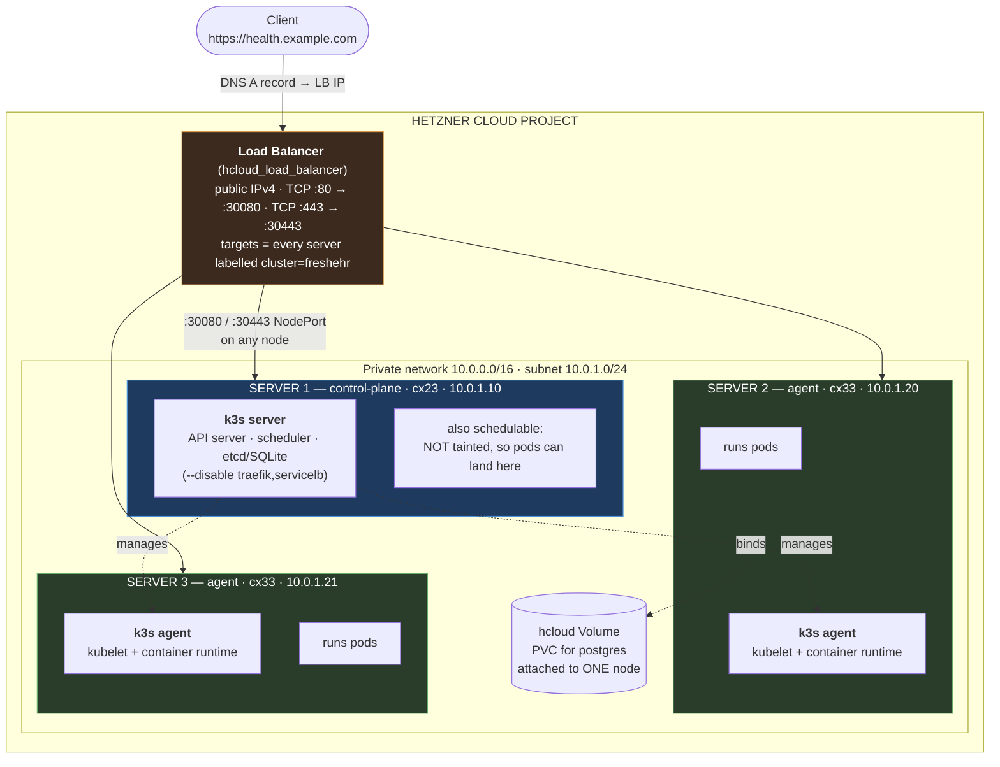
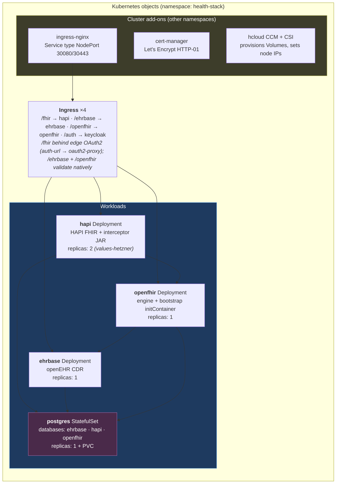

# Hetzner architecture — what actually gets created

What `terraform apply` in [`terraform/envs/hetzner/`](../terraform/envs/hetzner/) stands
up, and where each container ends up. Values shown are the defaults from
`variables.tf`.

## The whole picture (default: 3 servers)



**Terraform creates 14 objects in phase 1** (`install_apps=false`): network, subnet,
firewall, SSH key, 3 servers, LB, 2 LB services, LB targets, LB network attachment,
k3s token. **Phase 2 adds 7 more** — the Kubernetes objects below.

## Control-plane vs agent

Both are ordinary Hetzner VMs running Ubuntu. The difference is only which k3s command
cloud-init runs on them:

| | control-plane | agent |
|---|---|---|
| k3s role | `k3s server` | `k3s agent` |
| Runs the API server, scheduler, etcd | ✅ | ❌ |
| Runs your pods | ✅ *(not tainted here)* | ✅ |
| Knows the cluster state | ✅ | ❌ — asks the control-plane |
| If it dies | cluster is unmanageable (running pods keep serving) | its pods reschedule elsewhere |

"Agent" is just k3s's word for **worker node**. It joins by calling
`https://10.0.1.10:6443` with the shared token.

## Where the containers actually live

Kubernetes decides. You don't pick a node — you declare pods and the scheduler places
them. With the default 3 servers, this is *one plausible* placement:



**5 app pods + 1 database pod** on Hetzner (hapi runs 2 replicas there; the chart
default is 1). The add-ons (ingress-nginx, cert-manager, CCM, CSI) add a handful more
in `ingress-nginx`, `cert-manager` and `hcloud-system` namespaces.

**One Postgres, four databases.** All services share the single `postgres`
StatefulSet — `jdbc:postgresql://postgres:5432/{ehrbase,hapi,openfhir,keycloak}`.
The ehrbase image pre-provisions its own schema; `postgres-init-sql` creates the
`hapi`, `openfhir` and `keycloak` databases and their users on first boot.

**Four Ingress objects, not one.** `/fhir`, `/ehrbase`, `/openfhir` and the auth
routes (`/auth` + `/oauth2`) are separate Ingress resources because they need
different annotations — only `/fhir` carries the `auth-url` pair, and only
`/openfhir` carries the rewrite (see below).

## How a request flows

```
client → DNS(health.example.com) → LB public IP
      → LB TCP :443 → NodePort :30443 on whichever node answers
      → ingress-nginx pod → Ingress rule match
      → [auth-url subrequest on /fhir]   ← oauth2-proxy validates the Bearer JWT
      → hapi Service → hapi pod :8080
      → (IPS bundle) → openfhir Service → openfhir pod   (engine validates its own hapi-svc token natively, scope openfhir.map)
      → ehrbase Service → ehrbase pod    (EHRbase validates the token natively)
      → postgres Service :5432

token fetch: client → https://<domain>/auth/realms/freshehr/.../token → keycloak pod
```

The LB targets **all** nodes by the `cluster=freshehr` label and forwards to the
NodePort. Any node can accept the traffic — kube-proxy routes it onward to wherever
ingress-nginx is actually running.

**Edge OAuth2 (`ingress.auth`, ON in `values-hetzner.yaml`).** EHRbase and the
openFHIR engine both validate Bearer tokens in-app against the in-cluster
Keycloak, realm `freshehr` (`SECURITY_AUTHTYPE=OAUTH` for EHRbase;
`openfhir.protected=true` for the engine, which additionally enforces
fine-grained per-API scopes — `opt.*`, `fc.*`, `conceptmap.*`, `openfhir.map`,
`openfhir.insights` — and keys its data store by the shared `tenant: freshehr`
JWT claim). HAPI has no auth of its own: unauthenticated, `/fhir` accepts
writes on every resource type — and the openFHIR interceptor forwards matching
writes into EHRbase. So ingress-nginx gates `/fhir` with an `auth-url`
subrequest to the in-cluster oauth2-proxy, which validates the JWT (signature,
issuer `https://<domain>/auth/realms/freshehr`, audience `oauth2-proxy`). Client
secrets are generated by Terraform (`terraform output -raw kc_api_client_secret`
for external callers).

Because the `/fhir` gate is enforced *at the ingress*, only traffic arriving
from outside is challenged there. Kubelet probes keep working without
credentials (they hit the pod IP directly, and the engine's `/health` is
`permitAll`). The in-cluster hops ARE authenticated: HAPI→EHRbase (cdrs.yml)
and HAPI→openFHIR (`openfhir.oauth2.*`, `scope=openfhir.map`) both use the
`hapi-svc` client via the in-cluster `keycloak` Service (no LB hairpin for
token fetches).

**Companion releases self-register their OIDC clients.** This stack owns the
realm's *infrastructure* clients only (`api-client`, `hapi-svc`,
`oauth2-proxy`). An application deployed alongside it — e.g. the nictiz-ui EMR
— registers its own clients and users at install time via Keycloak's admin API
(a Helm hook Job using the bootstrap admin credentials from
`keycloak-secret`), so nothing app-specific lives in this repo. The realm is
the extension point; the admin Secret is the handshake.

**No snippet annotations anywhere.** The old basic-auth edge on the EMR needed
ingress-nginx's `allow-snippet-annotations=true` + `annotations-risk-level=
Critical` — a cluster-wide relaxation of the CVE-2021-25742 hardening — to
re-inject the username. With forward-auth those flags are gone from the
ingress-nginx release: anyone able to create an Ingress can no longer inject
nginx config.

## Do you need 3 servers?

**No — not for testing.** Set in `terraform.tfvars`:

```hcl
control_plane_type = "cx33"   # 4 vCPU / 8 GB
agent_count        = 0
```

That gives **one server running everything** (k3s schedules on the untainted
control-plane) and drops phase 1 from 14 → 12 objects. Verified: the LB still finds it,
because the LB selects on `cluster=`, a label the control-plane also carries.

| Config | Servers | ~€/mo incl. LB |
|---|---|---|
| default (1 cp + 2 agents) | 3 | ~€24 |
| single node | 1 | ~€13 |

**What multiple nodes buy you — and don't, yet.** In principle: capacity, survival of a
node failure, and rolling updates with no downtime. In *this* stack none of that holds
today, because every workload is `replicas: 1` and Postgres uses a `ReadWriteOnce`
volume bound to a single node. A node failure means downtime either way; extra nodes
give you *rescheduling*, not availability.

> The 2-agent default is kept as a production-shaped starting point. See
> **[Cluster sizing](../README.md#cluster-sizing--what-the-default-gives-you-and-what-it-doesnt)**
> in the README for the full comparison and the ordered scaling path (replicas +
> anti-affinity → HA Postgres → 3 control-planes).
